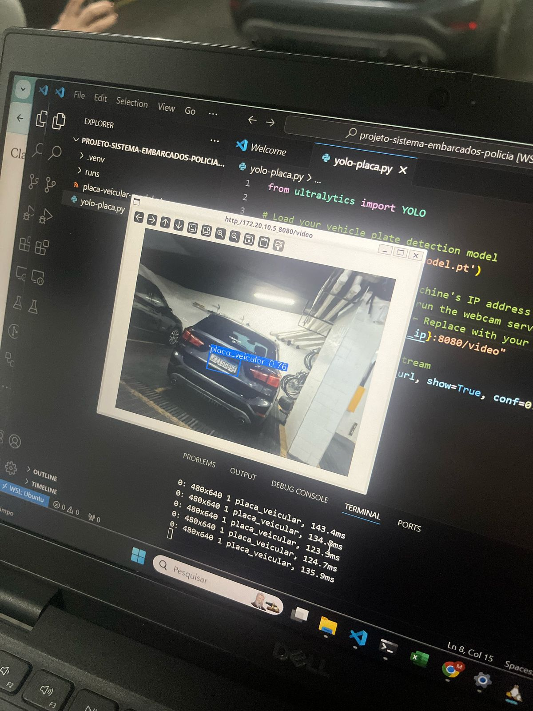

# IBMEC-SistemasEmbarcados

Esse repositório é destinado ao desenvolvimento de um produto baseado nos conhecimentos adquiridos na matéria Sistemas Embarcados.

# PlacaScan: Sistema de Reconhecimento de Placas Veiculares

[](https://opensource.org/licenses/MIT)
[](https://www.python.org/downloads/release/python-3100/)
[](https://github.com/ultralytics/ultralytics)
[](https://opencv.org/)

## Projeto Aplicado

Este projeto consiste no desenvolvimento de um sistema embarcado para uso pelas forças policiais do Rio de Janeiro. O sistema integra um leitor automático de placas de veículos em tempo real, permitindo a verificação instantânea da situação veicular. Ele identifica possíveis irregularidades, incluindo restrições administrativas, mandados de busca e apreensão, e registros de furto ou roubo. Com essa tecnologia, a fiscalização torna-se mais eficiente, contribuindo para a segurança pública e a agilidade no combate a crimes relacionados a veículos.

## Implementação

Estamos usando o modelo YOLO V8 nano como algoritmo para reconhecimento das placas.

## Visão Geral

PlacaScan é um sistema inteligente para detecção e reconhecimento de placas veiculares, desenvolvido como projeto acadêmico. O sistema utiliza visão computacional avançada e técnicas de inteligência artificial para identificar placas em imagens e vídeos e extrair o texto usando OCR.



## Características

- **Detecção em tempo real** de placas veiculares em streams de vídeo
- **Reconhecimento óptico de caracteres (OCR)** para extração do texto da placa
- **Interface intuitiva** para visualização dos resultados
- Suporte para diferentes formatos de placas (com foco em padrões brasileiros)

## Tecnologias

- **YOLOv8 nano**: Framework para detecção de objetos em tempo real
- **Python 3.10**: Linguagem de programação principal
<!-- - **OpenCV 4.7.0**: Processamento de imagens e manipulação de vídeo
- **Tesseract & EasyOCR**: Motores de reconhecimento de caracteres
- **SQLite**: Armazenamento local de dados e resultados// -->

## Instalação do PlacaScan

Siga estas etapas para configurar o ambiente de desenvolvimento do PlacaScan:

### 1. Clone o Repositório
Abra seu terminal ou prompt de comando e clone este repositório para sua máquina local. Certifique-se de ter o [Git](https://git-scm.com/) instalado.

```bash
git clone [https://github.com/SEU_USUARIO/IBMEC-SistemasEmbarcados.git](https://github.com/SEU_USUARIO/IBMEC-SistemasEmbarcados.git) # Substitua pelo URL correto do seu repositório
cd IBMEC-SistemasEmbarcados # Ou o nome da pasta onde o código do PlacaScan está localizado
```

### 2. Crie um Ambiente Virtual
É altamente recomendado usar um ambiente virtual para isolar as dependências do projeto. Navegue até a pasta do projeto clonado e crie um ambiente virtual (vamos chamá-lo de `.venv`).

```bash
python -m venv .venv
```
*Observação: Certifique-se de estar usando Python 3.10 ou compatível, conforme especificado no README.*

### 3. Ative o Ambiente Virtual
* **No Windows:**
    ```bash
    .\.venv\Scripts\activate
    ```
* **No macOS/Linux:**
    ```bash
    source .venv/bin/activate
    ```
Após a ativação, você verá o nome do ambiente (`.venv`) no início do prompt do seu terminal.

### 4. Instale as Dependências
Este projeto utiliza um arquivo `requirements.txt` para listar todas as bibliotecas Python necessárias. Certifique-se de que este arquivo (`requirements.txt`) esteja presente na raiz do projeto e contenha pelo menos as seguintes dependências (e quaisquer outras que você adicionar):

* `ultralytics` (para YOLOv8)
* `opencv-python` (para OpenCV)
* `pytesseract` (para OCR)
* *Outras dependências como `easyocr` se você quiser usar outros métodos de OCR*

Execute o seguinte comando para instalar todas as dependências listadas no arquivo:

```bash
pip install -r requirements.txt
```

### 5. Instale o Tesseract OCR no Windows
Como este projeto utiliza o pytesseract, é necessário instalar o Tesseract OCR no seu sistema:

* Baixe o instalador do Tesseract para Windows do site oficial: https://github.com/UB-Mannheim/tesseract/wiki
* Execute o instalador e siga as instruções (recomenda-se manter o caminho de instalação padrão: `C:\Program Files\Tesseract-OCR`)
* Adicione o caminho do Tesseract à variável de ambiente PATH do sistema ou especifique o caminho diretamente no código
* Verifique a instalação executando `tesseract --version` no prompt de comando

## Uso

### Detector básico

```python
# Exemplos de uso do detector básico serão adicionados em breve
```

### Pipeline completa

```python
# Exemplos de uso da pipeline completa serão adicionados em breve
```

## Desempenho

_Métricas de desempenho serão adicionadas em breve_

## Cronograma de Desenvolvimento

| Data | Atividade | Descrição |
|------|-----------|-----------|
| 18/02/2025 | Aula inaugural | Introdução à disciplina e discussão de possibilidades de projetos |
| 25/02/2025 | Definição do projeto | Seleção do tema e estabelecimento do objetivo de submissão ao SBRT |
| 04/03/2025 | Implementação inicial | Desenvolvimento da estrutura base utilizando YOLOv8 |
| 07/03/2025 | Desenvolvimento BD e treinamento | Configuração do armazenamento e treinamento do modelo (3 dias) |
| 11/03/2025 | Testes em tempo real | Avaliação de desempenho do sistema com webcam |
| 18/03/2025 | Integração OCR | Implementação do pipeline completo de reconhecimento |

## Estrutura do Projeto

_A estrutura detalhada do projeto será adicionada em breve_

## Trabalhos Futuros

- Expandir o dataset com mais placas brasileiras
- Implementar detecção de adulterações em placas
- Otimizar para dispositivos móveis

## Contribuições

_Instruções para contribuições serão adicionadas em breve_

## Licença

Este projeto está licenciado sob a Licença MIT - veja o arquivo [LICENSE](LICENSE) para detalhes.

## Agradecimentos

- Professor Rigel pelo suporte e orientação
- Professores e colegas do curso
- Comunidade YOLOv8 pelos excelentes recursos
<!-- - Contribuidores dos projetos OpenCV, Tesseract e EasyOCR -->
